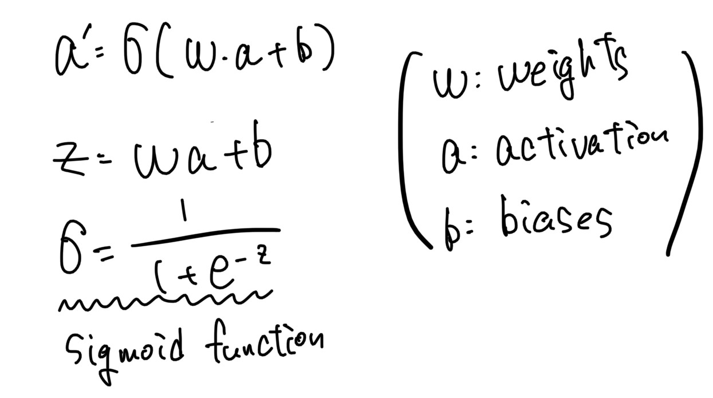
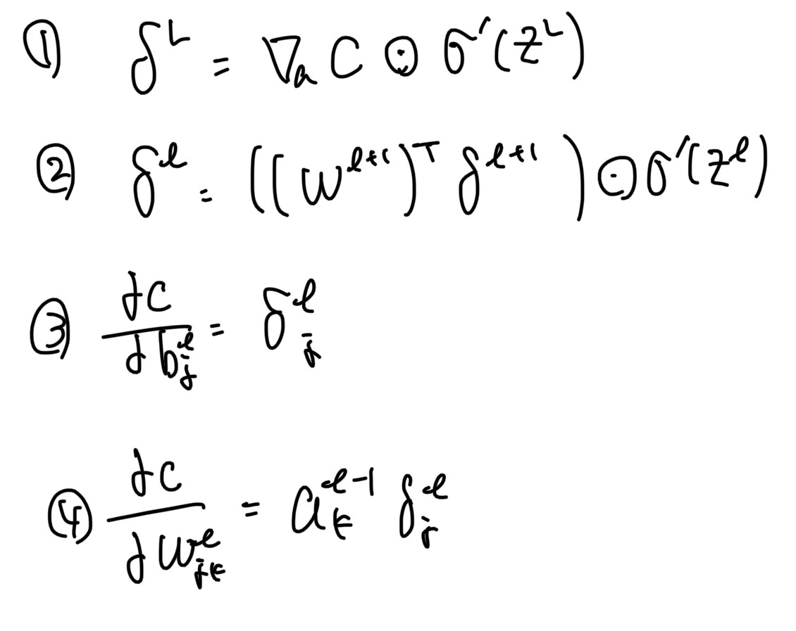

# Neural-Network-Handwritten-Digit-Recognization-Only-Numpy
### I have created a Neural Network to recognize handwritten digits from Scratch,only using Numpy.

## Model for this Neural Network

  

## Result
Layers: 784 30 10 
Learning Rate: 3 
Epochs: 10 
### 95% Accuracy

  

# Mathematical Parts 
## Feedforward
This calculates the activation for the next layer. 

  

## Sigmoid Function
Activation Function I used this time!  

  

## Stochastic Gradient Discent Algorithm
1. Loop For Epochs times
   - shuffle training data
   - divide training data into mini batches
   - Loop for each mini batch
     - BackPropagation
   - Update Weights and Biases of the Network using Gradient Descent

## Backpropagation Algorithm
1. Feedforward
2. Output Error: Equation 1
3. BackPropagate Error: Equation 2
4. Calculate δb,δw: Equasion 3,4

  

